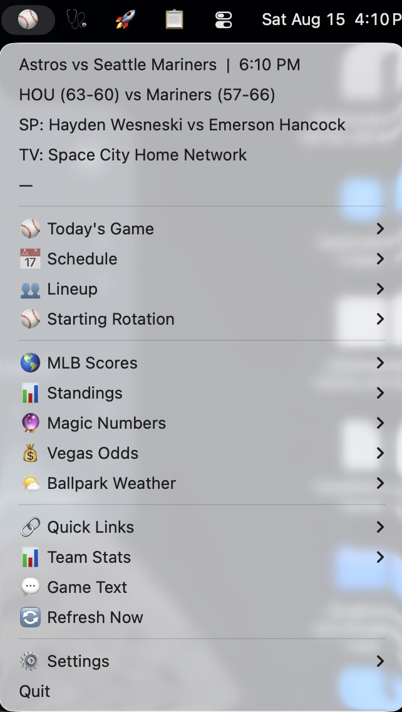

# ⚾ Astros Menu Bar

[](https://github.com/gyndok/astros-menubar/releases)
[](https://github.com/gyndok/astros-menubar/releases/latest)
[](LICENSE)

Follow the Houston Astros all season from your macOS menu bar. Live scores,
schedule, lineups, standings, magic numbers, Vegas odds, ballpark weather,
and a league-wide scoreboard — one click away, all day.

<p align="center">
  
</p>

The menu bar icon is the scoreboard — you never have to open the menu to
know how the game is going:

| You see | It means |
|---------|----------|
| ⚾ | No game right now |
| <code>2-5 ▼7</code> in **green** | Game on — Astros winning (away-home score, ▼7 = bottom 7th) |
| <code>6-5 ▲9</code> in **red** | Astros losing |
| score in **yellow** | Tied |
| <code>2-5 F</code> in green/red | Final — held for 30 minutes, then back to ⚾ |

## Features

- **Live game tracking** — score, inning, count, outs, runners, current
  pitcher/batter, refreshed every 60 seconds during games
- **⚾ Today's Game** — matchup, probable starters, records, venue, TV broadcast
- **📅 Schedule** — next 10 games with probable pitchers and broadcasts
- **👥 Lineup** — batting order 1–9 once it's posted
- **⚾ Starting Rotation** — upcoming probables with W-L and ERA
- **🌎 MLB Scores** — every game in the league today in three sections:
  live (with inning), completed, and upcoming (Astros game starred ⭐)
- **📊 Standings** — full MLB drill-down: league → division → wild card
- **🔮 Magic Numbers** — numbers to win the AL West, make the playoffs,
  clinch a wild card, and lock up the #1 AL seed
- **💰 Vegas Odds** — moneyline, run line, and over/under (optional, free API key)
- **🌤 Ballpark Weather** — current conditions wherever tonight's game is
- **💬 Game Text** — copies a witty, situation-aware message to your
  clipboard, ready to paste into the group text
- **Notifications** — game starting soon, final score, Astros scoring plays,
  lineup posted (each individually toggleable in ⚙️ Settings)

Polling is adaptive: 60s during games and the half hour before first pitch,
15–30 minutes otherwise, so it's easy on the APIs and your battery.

📖 **[Full User's Guide](docs/USER_GUIDE.md)** — every menu and setting explained.

## Install

### Option 1: Download the app (Apple Silicon)

Grab the latest `.zip` from [Releases](https://github.com/gyndok/astros-menubar/releases),
unzip, drag **Astros Menu Bar.app** to Applications, and double-click.
Signed and notarized by Apple — no security warnings.

### Option 2: From source (any Mac)

Requires macOS and [Homebrew](https://brew.sh).

```bash
brew install python
git clone https://github.com/gyndok/astros-menubar.git
cd astros-menubar
./install.sh
```

The ⚾ icon appears in your menu bar and starts automatically at login.

### Vegas odds (optional)

Grab a free API key at [the-odds-api.com](https://the-odds-api.com), then add
it to `~/.config/astros-menubar/config.yaml`:

```yaml
odds_api_key: "your-key-here"
```

### Notifications

If notifications don't appear, check **System Settings → Notifications →
Python** and make sure they're allowed.

## Uninstall

```bash
./uninstall.sh
```

## How it works

A single Python file built on [rumps](https://github.com/jaredks/rumps).
Data comes from the free, keyless [MLB Stats API](https://statsapi.mlb.com)
(scores, schedule, standings, lineups, stats),
[Open-Meteo](https://open-meteo.com) (weather), and optionally
[The Odds API](https://the-odds-api.com) (betting lines). Everything is
cached in `~/.config/astros-menubar/` so menus populate instantly on launch.

Run it in the foreground for development:

```bash
python3 astros_menubar.py
```

Not affiliated with MLB or the Houston Astros. Go Stros. 🚀

## License

[MIT](LICENSE)
